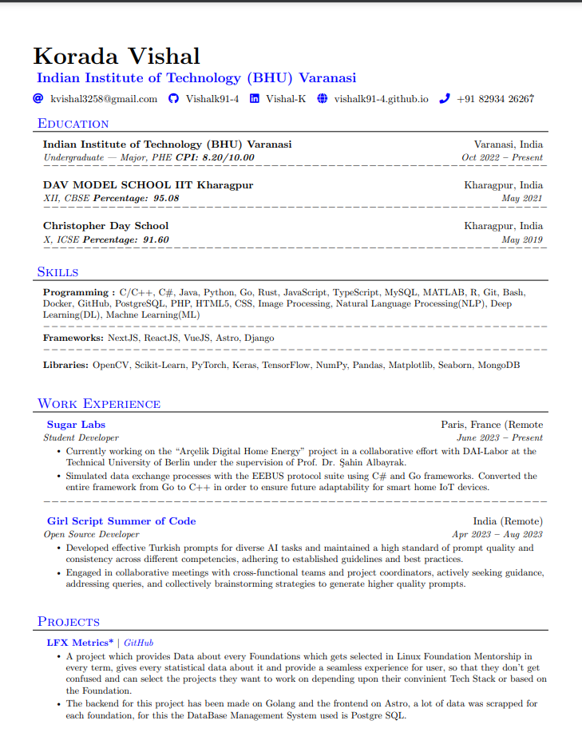

# Vishalk91-4-Resume
Personalized Resume Template for Software Development Role / Research Role written using LaTeX. 
In my RESUME, all of my projects, work experience, technical skills, contacts and scoial media handles can be found.

## Run on Terminal

```sh
pdflatex main.tex
```

## Screenshots

<p align="center">
    
    
</p>

## Author

👤 **Korada Vishal**

* LinkedIn: [@vishalk](https://www.linkedin.com/in/vishal-k-2865b6254)
* GitHub: [@vishalk91-4](https://github.com/Vishalk91-4)